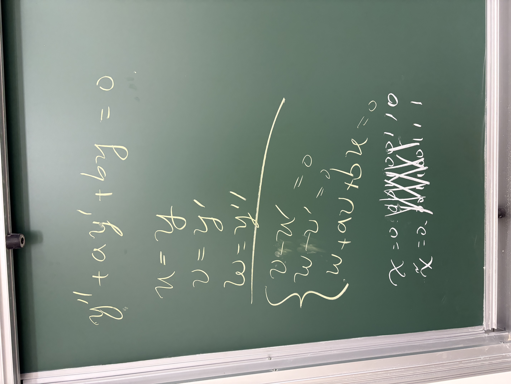
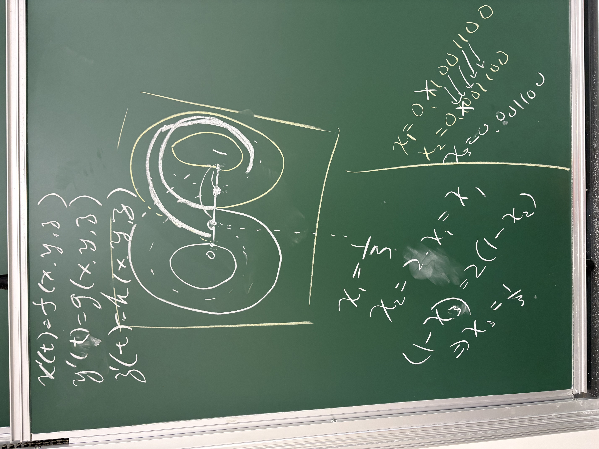

---
jupyter:
  jupytext:
    text_representation:
      extension: .md
      format_name: markdown
      format_version: '1.3'
      jupytext_version: 1.19.6
  kernelspec:
    display_name: SageMath 10.9
    language: sage
    name: sagemath
---

# ENGINEERING MATHEMATICS: DIFFERENTIAL EQUATIONS — 0916


## 1.3 DEs as Mathematical Models


### Motion with resistance


Position $x(t)$, velocity $v(t)$, and acceleration $a(t)$ satisfy
$$ v = x', \qquad a = v' = x''. $$
With an applied force $F$ and resistance proportional to velocity, Newton's second law gives
$$ F - \beta v = ma\quad \Longrightarrow \quad mx'' + \beta x' = F. $$


#### Throwing a ball


Throw a ball from ground level with speed $v_0$ at angle $\theta$ above the horizontal.  
Let $x(t)$ be horizontal distance and $y(t)$ be height;  
neglect wind and spin.  
With constant gravity and no air resistance,
$$ x'' = 0, \qquad y'' = -g. $$
For $x(0) = y(0) = 0$, $x'(0) = v_0\cos\theta$, and $y'(0) = v_0\sin\theta$,
$$ x(t) = v_0\cos\theta\,t, \qquad y(t) = v_0\sin\theta\,t - \frac12gt^2. $$
Eliminating $t$ gives a parabola:
$$ y = x\tan\theta - \frac{gx^2}{2v_0^2\cos(\theta)^2}. $$


For an illustrative **linear drag** model, take $\mathbf F_{\mathrm{drag}} = -\beta\mathbf v$.  
Writing $\lambda = \beta/m > 0$, the equations become
$$ x'' + \lambda x' = 0, \qquad y'' + \lambda y' = -g. $$
With the same initial position and velocity, their solutions are
$$ x(t) = \frac{v_0\cos\theta}{\lambda}(1 - e^{-\lambda t}), $$
$$ y(t) = \frac{v_0\sin\theta + g/\lambda}{\lambda}(1 - e^{-\lambda t}) - \frac g\lambda t. $$
The resulting trajectory is a curved arc with a lower peak and shorter range.  
Horizontal velocity decreases,  
and the ascending and descending portions are asymmetric.


The Sage plot compares the same throw with $v_0 = 20\ \mathrm{m/s}$,  
$\theta = 45^\circ$, and $g = 9.81\ \mathrm{m/s^2}$.  
For the drag curve, choose $\lambda = 0.35\ \mathrm{s}^{-1}$ as an illustrative value.  
Each trajectory stops when the ball returns to ground level.

```sage vscode={"languageId": "python"}
ball_t = SR.var('ball_t')
ball_g, ball_speed, ball_angle, ball_drag = 9.81, 20, pi/4, 0.35
ball_vx, ball_vy = ball_speed*cos(ball_angle), ball_speed*sin(ball_angle)
ball_x_free = ball_vx*ball_t
ball_y_free = ball_vy*ball_t - ball_g*ball_t**2/2
ball_x_drag = ball_vx*(1 - exp(-ball_drag*ball_t))/ball_drag
ball_y_drag = ((ball_vy + ball_g/ball_drag)*(1 - exp(-ball_drag*ball_t))
               - ball_g*ball_t)/ball_drag
ball_time_free = float(2*ball_vy/ball_g)
ball_time_drag = find_root(ball_y_drag, 0.01, ball_time_free)
```

```sage vscode={"languageId": "python"}
ball_plot = parametric_plot((ball_x_free, ball_y_free), (ball_t, 0, ball_time_free),
                            color='#0072B2', thickness=2.5, legend_label='No drag: parabola')
ball_plot += parametric_plot((ball_x_drag, ball_y_drag), (ball_t, 0, ball_time_drag),
                             color='#D55E00', thickness=2.5, legend_label='Linear drag')
ball_plot += point((0, 0), color='black', size=30)
ball_plot.show(xmin=0, ymin=0, ymax=14, aspect_ratio=1, figsize=[10, 4],
               axes_labels=['Horizontal distance (m)', 'Height (m)'],
               frame=True, axes=False, legend_options={'loc': 'upper right'})
```

**Read the picture:** Both curves start with the same tangent direction.  
Compare their maximum heights, horizontal ranges, and shapes near landing.  
The drag trajectory is not a parabola,  
even though it still looks like a familiar throwing arc.


#### Faster motion and atmospheric drag


For many flows where inertia dominates viscous effects, aerodynamic drag is modeled by
$$ D = \frac12\rho C_D A V^2, \qquad \mathbf F_{\mathrm{drag}} = -\frac12\rho C_D A V\mathbf v, \qquad V = |\mathbf v|. $$
Here $\mathbf v$ is velocity relative to the air, $\rho$ is air density,  
$A$ is reference area, and $C_D$ is the drag coefficient.  
For approximately fixed $\rho$, $C_D$, and $A$, the force is quadratic in speed.  
The rate of energy dissipation is $P = DV$, which is cubic in speed under the same assumptions.  
At high speeds, $C_D$ also depends on flow conditions such as Mach number,  
so a single constant-coefficient power law is an approximation.

Sources: NASA, [Drag equation](https://www1.grc.nasa.gov/beginners-guide-to-aeronautics/drag-equation/) and [Drag coefficient](https://www1.grc.nasa.gov/beginners-guide-to-aeronautics/drag-coefficient/).


An **intercontinental ballistic missile (ICBM)** illustrates why the surrounding medium matters.  
Much of its midcourse flight takes place outside the atmosphere,  
where air resistance is negligible.  
During atmospheric reentry, aerodynamic drag becomes important again.  
Changing air density and high-speed flow  
make this much more complex than the constant-$\lambda$ ball model.

Reference: Missile Defense Agency, [Ballistic missile flight phases](https://www.mda.mil/system/elements.html).


### Population growth


If the rate of increase is proportional to the current population,

$$ A' = kA. $$

For constant $k$, the solution is $A(t) = A(0)e^{kt}$.


### Newton's law of cooling


For a constant ambient temperature $T_m$,

$$ T' = k(T - T_m). $$

With this sign convention, cooling requires $k<0$.

Equivalently, write $T' = -\lambda(T - T_m)$ with $\lambda>0$.

$$ T(t) = T_m + [T(0) - T_m]e^{-\lambda t}. $$


### From integration to differential equations


If $A' = f(t)$, we can integrate directly.  
For example,
$$ A' = \frac1t \quad \Longrightarrow \quad A = \ln|t| + C \qquad (t \ne 0), $$
$$ A' = \frac1{t^2 + 4} \quad \Longrightarrow \quad A = \frac12\arctan\frac t2 + C. $$

When the right-hand side also contains the unknown function, as in $A' = kA$,  
or when higher derivatives appear,  
we need additional solution methods.


## 2.1 Draw a Solution


### Direction fields


For $y' = f(x, y)$, draw a short line segment of slope $f(x_0, y_0)$ at each sampled point $(x_0, y_0)$.

Solution curves follow these directions.

**Example 1: $y' = 0.2xy$.**

- The slope is zero when $x = 0$ or $y = 0$.
- The slope is positive when $xy>0$ and negative when $xy<0$.
- The general solution is $y = Ce^{0.1x^2}$.


The conditions $y(0) = 2$ and $y(0) = -1$ select the highlighted curves below.
The dots mark their initial values; the gray segments show the prescribed slopes.

```sage vscode={"languageId": "python"}
sx, sy = SR.var('sx sy')
field_xy = plot_slope_field(sx*sy/5, (sx, -3, 3), (sy, -4, 6),
                           plot_points=23, color='silver')
for initial in [-1.5, -0.5, 0, 0.5, 1]:
    field_xy += plot(initial*exp(sx**2/10), (sx, -3, 3),
                     color='silver', thickness=1)
for initial, color in [(2, '#0072B2'), (-1, '#D55E00')]:
    field_xy += plot(initial*exp(sx**2/10), (sx, -3, 3),
                     color=color, thickness=2.5, legend_label=f'y(0) = {initial}')
    field_xy += point((0, initial), color=color, size=35)
field_xy.show(xmin=-3, xmax=3, ymin=-4, ymax=6, axes_labels=['$x$', '$y$'], figsize=7)
```

**Example 2: $y' = \sin y$.**

- The constant functions $y = k\pi$, with $k\in\mathbb Z$, are equilibrium solutions.
- For $y(0) = -3/2$, the initial slope is negative.

  As time moves forward, the solution approaches $-\pi$.

Direction fields reveal qualitative behavior even when an explicit formula is difficult to obtain.


```sage vscode={"languageId": "python"}
field_sin = plot_slope_field(sin(sy), (sx, 0, 6), (sy, -4, 4),
                            plot_points=25, color='silver')
for level in [-pi, 0, pi]:
    field_sin += plot(level, (sx, 0, 6), color='black', linestyle='--')
for initial, color in [(-1.5, '#D55E00'), (-0.3, '#CC79A7'), (0.4, '#0072B2'), (2, '#009E73')]:
    curve = 2*arctan(tan(initial/2)*exp(sx))
    field_sin += plot(curve, (sx, 0, 6), color=color, thickness=2,
                      legend_label=f'y(0) = {initial}')
    field_sin += point((0, initial), color=color, size=25)
field_sin.show(xmin=0, xmax=6, ymin=-4, ymax=4, axes_labels=['$x$', '$y$'], figsize=7)
```

The dashed curves are the equilibria $y = -\pi$, $y = 0$, and $y = \pi$.
The orange curve starts at $-3/2$ and approaches $-\pi$.
Nearby curves move away from $0$ and toward $\pm\pi$ as $x$ increases.


The planar slope fields used here apply to scalar first-order equations.

Higher-order equations can be rewritten as first-order systems and studied using other tools.





### Lotka–Volterra: predator and prey


Let $p(t)$ and $q(t)$ be scaled prey and predator populations.
A dimensionless **Lotka–Volterra model** is
$$ p' = p(1 - q), \qquad q' = q(p - 1). $$
Prey grow when predators are scarce ($q < 1$).
Predators grow when prey are plentiful ($p > 1$).
The positive equilibrium is $(p, q) = (1, 1)$.


In the **phase plane**, each point represents both populations at one time.
The arrows give $(p', q')$; a solution traces a path following them.
The dashed lines $p = 1$ and $q = 1$ separate regions of population growth and decline.
Arrow lengths are rescaled for readability; their directions are preserved.

```sage vscode={"languageId": "python"}
prey, predator = SR.var('prey predator')
lv_rhs = [prey*(1 - predator), predator*(prey - 1)]
lv_times = [0.02*j for j in range(1501)]
lv_initials = [(1.2, 1.0), (1.6, 0.8), (2.3, 1.0)]
lv_colors = ['#009E73', '#0072B2', '#D55E00']
lv_solutions = [desolve_odeint(lv_rhs, initial, lv_times, [prey, predator],
                             rtol=1e-10, atol=1e-10) for initial in lv_initials]
speed = sqrt(lv_rhs[0]**2 + lv_rhs[1]**2 + 0.04)
lv_phase = plot_vector_field([component/speed for component in lv_rhs],
                            (prey, 0.05, 2.7), (predator, 0.05, 2.7),
                            plot_points=19, color='silver')
```

```sage vscode={"languageId": "python"}
for solution, initial, color in zip(lv_solutions, lv_initials, lv_colors):
    lv_phase += line(solution, color=color, thickness=2)
    lv_phase += point(initial, color=color, size=35)
lv_phase += line([(1, 0), (1, 2.7)], color='black', linestyle='--', alpha=0.5)
lv_phase += line([(0, 1), (2.7, 1)], color='black', linestyle='--', alpha=0.5)
lv_phase += point((1, 1), color='black', size=45)
lv_phase.show(xmin=0, xmax=2.7, ymin=0, ymax=2.7, aspect_ratio=1,
              axes_labels=['Prey $p$', 'Predators $q$'], figsize=7)
```

The colored trajectories circle the coexistence equilibrium counterclockwise.
In this idealized model, positive non-equilibrium trajectories are closed orbits:
the populations cycle rather than converge to $(1, 1)$.
The colored dots mark the starting populations; the black dot marks the equilibrium.

```sage vscode={"languageId": "python"}
lv_sample = lv_solutions[1]
lv_history = line(list(zip(lv_times, lv_sample[:, 0])), color='#0072B2',
                  thickness=2, legend_label='Prey p(t)')
lv_history += line(list(zip(lv_times, lv_sample[:, 1])), color='#D55E00',
                   thickness=2, legend_label='Predators q(t)')
lv_history.show(xmin=0, xmax=30, ymin=0, axes_labels=['Time $t$', 'Population'],
                figsize=[9, 4])
```

This time plot follows the blue phase-plane trajectory, starting at $(1.6, 0.8)$.
Prey reach their peak before predators do.
As predators become abundant, prey decline; the shortage of prey then reduces predators.

**Read the pictures:** At which line does each population stop increasing?
Relate each peak in the time plot to a crossing of a dashed line in the phase plane.


#### Lyapunov stability of the coexistence equilibrium


The equilibrium $(p, q) = (1, 1)$ is **Lyapunov stable**:  
solutions starting sufficiently close to it remain close for all future time.  
More precisely, for every $\varepsilon > 0$, there is a $\delta > 0$ such that
$$ \|(p(0), q(0)) - (1, 1)\| < \delta \quad\Longrightarrow\quad \|(p(t), q(t)) - (1, 1)\| < \varepsilon \quad\text{for all } t \ge 0. $$
It is **not asymptotically stable**:  
nearby non-equilibrium solutions keep circling instead of converging to $(1, 1)$.


For $p, q > 0$, consider
$$ V(p, q) = p - 1 - \ln p + q - 1 - \ln q. $$
Each term is nonnegative, so $V$ has a strict minimum of $0$ at $(1, 1)$.  
Along a solution,
$$ \frac{dV}{dt} = \left(1 - \frac1p\right)p(1 - q) + \left(1 - \frac1q\right)q(p - 1) = 0. $$
The solution stays on a level curve of $V$.  
Small level curves surround $(1, 1)$ and trap nearby solutions, establishing Lyapunov stability.  
Since a non-equilibrium solution has constant $V > 0$, it cannot approach $(1, 1)$.


### Lorenz system: the butterfly attractor


The **Lorenz system** is a simplified model of thermal convection:
$$ x' = \sigma(y - x), \qquad y' = x(\rho - z) - y, \qquad z' = xy - \beta z. $$
The variables describe scaled convection and temperature modes.  
These are three coupled nonlinear ODEs, with time as the independent variable.

For the classical parameters
$$ \sigma = 10, \qquad \rho = 28, \qquad \beta = \frac83, $$
typical trajectories trace the two wings of a **chaotic attractor**.  
The motion switches irregularly between the wings instead of repeating a periodic orbit.


The **butterfly effect** refers to sensitivity to initial conditions.  
Two solutions starting very close together can eventually become very different,  
even though they obey exactly the same deterministic equations.

Reference: E. N. Lorenz (1963), [Deterministic nonperiodic flow](https://doi.org/10.1175/1520-0469%281963%29020%3C0130%3ADNF%3E2.0.CO%3B2).




```sage vscode={"languageId": "python"}
lor_x, lor_y, lor_z = SR.var('lor_x lor_y lor_z')
lor_sigma, lor_rho, lor_beta = 10, 28, 8/3
lor_rhs = [lor_sigma*(lor_y - lor_x), lor_x*(lor_rho - lor_z) - lor_y,
           lor_x*lor_y - lor_beta*lor_z]
lor_times = [0.005*j for j in range(10001)]
lor_initials = [[1, 1, 1], [1.00001, 1, 1]]
lor_solutions = [desolve_odeint(lor_rhs, initial, lor_times, [lor_x, lor_y, lor_z],
                              rtol=1e-11, atol=1e-12) for initial in lor_initials]
```

```sage vscode={"languageId": "python"}
lor_orbit = lor_solutions[0][1000:]
lor_points = list(zip(lor_orbit[:, 0], lor_orbit[:, 1], lor_orbit[:, 2]))
lor_butterfly = line3d(lor_points, color='#0072B2', thickness=2)
lor_butterfly.show(viewer='threejs', online=True, frame=True,
                   axes_labels=['x', 'y', 'z'], aspect_ratio=1)
```

This is the full three-dimensional trajectory, shown as an interactive figure.  
Drag with the mouse to rotate the viewpoint and see both wings of the attractor.  
The first five time units are omitted to emphasize the attractor.

```sage vscode={"languageId": "python"}
lor_history = Graphics()
for solution, color, label in zip(lor_solutions, ['#0072B2', '#D55E00'],
                                   ['x(0) = 1', 'x(0) = 1.00001']):
    lor_history += line(list(zip(lor_times, solution[:, 0])), color=color,
                        thickness=1.2, legend_label=label)
lor_history.show(xmin=0, xmax=50, ymin=-25, ymax=30, figsize=[10, 4],
                 axes_labels=['Time $t$', '$x(t)$'], frame=True, axes=False,
                 legend_options={'loc': 'upper right'})
```

Both solutions begin with $y(0) = z(0) = 1$; their initial $x$ values differ by $10^{-5}$.  
Their graphs nearly overlap at first and separate later.  
Long-term pointwise predictions are sensitive to initial uncertainty and numerical error.

**Read the pictures:**  
Compare this irregular motion with the repeating population cycles in Lotka–Volterra.


### Belousov–Zhabotinsky reaction: chemical oscillations


The **Belousov–Zhabotinsky (BZ) reaction** is a chemical oscillator.  
Concentrations of reaction intermediates can rise and fall repeatedly,  
producing visible color changes as the catalyst changes oxidation state.

A reduced **two-variable Oregonator model** describes a well-mixed system:
$$ \varepsilon\frac{dx}{d\tau} = x(1 - x) - fz\frac{x - q}{x + q}, \qquad \frac{dz}{d\tau} = x - z. $$
Here $x$ is a scaled activator concentration and $z$ is a scaled oxidized-catalyst concentration.  
Time $\tau$ and the parameters are dimensionless.


Watch BZ reaction demonstrations: [YouTube search: BZ equation](https://www.youtube.com/results?search_query=BZ+equation).


The positive parameter $\varepsilon$ sets the relative time scales;  
$q$ comes from reaction-rate ratios, and $f$ is a stoichiometric factor.  
The nonlinear feedback can produce repeated rapid pulses and slow recovery.  
This model treats the main reactant reservoirs as approximately constant;  
a batch reaction eventually stops oscillating as its reactants are consumed.

Reference: R. J. Field, [Oregonator](https://www.scholarpedia.org/article/Oregonator).


#### Spatial patterns: the reaction–diffusion PDE


In an unstirred medium, concentrations also vary with position $\mathbf r$.  
Adding diffusion gives a spatial Oregonator model:
$$ \frac{\partial x}{\partial\tau} = \frac1\varepsilon\left[x(1 - x) - fz\frac{x - q}{x + q}\right] + D_x\nabla^2x, $$
$$ \frac{\partial z}{\partial\tau} = x - z + D_z\nabla^2z. $$
Here $x = x(\mathbf r, \tau)$, $z = z(\mathbf r, \tau)$, and $D_x, D_z$ are diffusion coefficients.  
In two spatial dimensions, $\nabla^2 = \partial^2/\partial r_1^2 + \partial^2/\partial r_2^2$.  
These PDEs describe local reaction together with spatial spreading;  
BZ media can exhibit traveling waves and spiral patterns.


Spatially uniform concentrations have $\nabla^2x = \nabla^2z = 0$,  
so the PDE reduces to the ODE system above.  
The following plots show this spatially uniform case.  
A spatial simulation also requires an initial concentration field and boundary conditions.

Reference: [Adamatzky (2016), Section 2](https://journals.plos.org/plosone/article?id=10.1371/journal.pone.0168267),  
with no applied illumination; here diffusion of both variables is allowed.


For an illustrative oscillating case, choose
$$ \varepsilon = 0.04, \qquad q = 0.002, \qquad f = 1.4, \qquad x(0) = z(0) = 0.1. $$
Sage computes the solution numerically.  
The first graph shows the concentrations; the second follows the same solution in the phase plane.

```sage vscode={"languageId": "python"}
bz_x, bz_z = SR.var('bz_x bz_z')
bz_epsilon, bz_q, bz_f = 0.04, 0.002, 1.4
bz_rhs = [(bz_x*(1 - bz_x) - bz_f*bz_z*(bz_x - bz_q)/(bz_x + bz_q))/bz_epsilon,
          bz_x - bz_z]
bz_times = [0.005*j for j in range(6001)]
bz_solution = desolve_odeint(bz_rhs, [0.1, 0.1], bz_times, [bz_x, bz_z],
                            rtol=1e-10, atol=1e-11)
```

```sage vscode={"languageId": "python"}
bz_history = line(list(zip(bz_times, bz_solution[:, 0])), color='#0072B2',
                  thickness=2, legend_label='Activator x')
bz_history += line(list(zip(bz_times, bz_solution[:, 1])), color='#D55E00',
                   thickness=2, legend_label='Oxidized catalyst z')
bz_history.show(xmin=0, xmax=30, ymin=0, ymax=0.95, figsize=[9, 4],
                axes_labels=[r'Time $\tau$', 'Scaled concentration'],
                frame=True, axes=False, legend_options={'loc': 'upper right'})
```

```sage vscode={"languageId": "python"}
bz_phase = line(bz_solution[:2001], color='silver', thickness=1.5,
                legend_label='Initial transient')
bz_phase += line(bz_solution[2000:], color='#0072B2', thickness=2,
                 legend_label='Later trajectory')
bz_phase += point((0.1, 0.1), color='black', size=35)
bz_phase.show(xmin=0, xmax=0.85, ymin=0, ymax=0.32, figsize=[7, 4],
              axes_labels=['Activator $x$', 'Oxidized catalyst $z$'],
              frame=True, axes=False, legend_options={'loc': 'upper right'})
```

The time plot shows sharp activator pulses followed by a slower catalyst response.  
After the initial transient, the phase-plane trajectory approaches a repeating loop.  
This illustrates a **limit cycle**, an isolated periodic orbit.

**Compare with Lotka–Volterra:**  
Its idealized positive trajectories form a family of closed orbits.  
Here the numerical trajectory settles toward an attracting cycle.  
Which parts of the BZ loop correspond to rapid changes in the time plot?


#### Spatial simulation: a rotating chemical wave


The GIF follows the activator concentration $x(r_1, r_2, \tau)$ on a square grid.  
Bright regions have more activator; the color scale stays fixed throughout the animation.

Use $\varepsilon = 0.04$, $q = 0.01$, $f = 2.5$, $D_x = 1$, and $D_z = 0$.  
These parameters select an excitable regime, different from the uniform oscillation example.  
The activator diffuses, while the catalyst provides local recovery feedback.


Begin near the uniform equilibrium, with a short excited strip and an adjacent recovery region.  
The broken wavefront curls into a spiral as excitation spreads into recovered material.

The grid has $128 \times 128$ cells with spacing $\Delta r = 0.5$.  
Reflecting edges impose **no-flux boundary conditions**.  
A five-point spatial difference and forward Euler time step $\Delta\tau = 0.001$ approximate the PDE.  
The animation covers $0 \le \tau \le 40$ and restarts at its initial state when it loops.

```sage vscode={"languageId": "python"}
import numpy as np
from scipy.ndimage import laplace
from PIL import Image as PILImage
from matplotlib.backends.backend_agg import FigureCanvasAgg
from pathlib import Path
bz_grid, bz_dx, bz_dt = 128, 0.5, 0.001
bz_sp_eps, bz_sp_q, bz_sp_f = 0.04, 0.01, 2.5
bz_Dx, bz_Dz = 1.0, 0.0
bz_rest = (-(bz_sp_f + bz_sp_q - 1)
           + np.sqrt((bz_sp_f + bz_sp_q - 1)**2 + 4*bz_sp_q*(1 + bz_sp_f)))/2
```

```sage vscode={"languageId": "python"}
bz_field_x = np.full((bz_grid, bz_grid), float(bz_rest))
bz_field_z = bz_field_x.copy()
bz_field_x[64:70, :64] = 0.8
bz_field_z[:64, :64] = 0.1
bz_initial_x, bz_initial_z = bz_field_x.copy(), bz_field_z.copy()
bz_snapshots = [bz_field_x.copy()]
bz_frame_times = [0.0]
```

```sage vscode={"languageId": "python"}
def bz_spatial_step(field_x, field_z, dt):
    reaction = (field_x*(1 - field_x)
                - bz_sp_f*field_z*(field_x - bz_sp_q)/(field_x + bz_sp_q))/bz_sp_eps
    rate_x = reaction + bz_Dx*laplace(field_x, mode='reflect')/bz_dx**2
    rate_z = field_x - field_z
    return field_x + dt*rate_x, field_z + dt*rate_z
```

```sage vscode={"languageId": "python"}
for step in range(1, 40001):
    bz_field_x, bz_field_z = bz_spatial_step(bz_field_x, bz_field_z, bz_dt)
    if step % 250 == 0:
        assert np.isfinite(bz_field_x).all() and np.isfinite(bz_field_z).all()
        assert bz_field_x.min() >= 0 and bz_field_z.min() >= 0
        bz_snapshots.append(bz_field_x.copy())
        bz_frame_times.append(float(step*bz_dt))
```

```sage vscode={"languageId": "python"}
bz_frames = []
for field, time in zip(bz_snapshots, bz_frame_times):
    picture = matrix_plot(matrix(RDF, field), cmap='inferno', vmin=0, vmax=0.8,
                          flip_y=False, colorbar=True, axes=False, frame=True)
    figure = picture.matplotlib(figsize=5, title=f'BZ activator x: time = {time:.2f}')
    FigureCanvasAgg(figure)
    figure.canvas.draw()
    pixels = np.asarray(figure.canvas.buffer_rgba()).copy()
    bz_frames.append(PILImage.fromarray(pixels).convert('RGB'))

```

```sage vscode={"languageId": "python"}
bz_gif = Path('0916/bz_spatial.gif')
bz_gif.parent.mkdir(parents=True, exist_ok=True)
bz_frames[0].save(bz_gif, save_all=True, append_images=bz_frames[1:],
                  duration=70, loop=0, optimize=False)
print(f'Saved {len(bz_frames)} frames to {bz_gif}')
```


**Read the animation:**  
Watch the wave curl around its tip and expand outward.  
A recently excited region must recover before another excitation wave can pass.  
The colors represent the model variable, rather than the literal colors of a laboratory mixture.

[Download the GIF](0916/bz_spatial.gif).


## Further Study: 2.6 Euler's Method


This section is not listed separately in the current weekly schedule.

Approximate the derivative by a difference quotient:

$$ \frac{y(x_{n + 1}) - y(x_n)}{x_{n + 1} - x_n} \approx f(x_n, y(x_n)). $$

With step size $h = x_{n + 1} - x_n$, the forward Euler method is

$$ \boxed{x_{n + 1} = x_n + h, \qquad y_{n + 1} = y_n + h f(x_n, y_n)}. $$


Here $y_n$ is a numerical approximation, usually different from the exact value $y(x_n)$.

Example: $y' = 0.2xy$, $y(0) = 2$, and $h = 0.1$.

$$ y_1 = 2 + 0.1(0.2\cdot0\cdot2) = 2, $$
$$ y_2 = 2 + 0.1(0.2\cdot0.1\cdot2) = 2.004. $$

Smaller step sizes generally improve accuracy, but the variation of the function and the stability of the method also matter.


Numerical methods are useful for computer simulation, at the cost of truncation and accumulated errors.


### Euler's method: comparing numerical errors


The example $y' = \sin x$, $y(0) = -1$ has the exact solution $y = -\cos x$.

The following code compares errors at $x = 10$ for different step sizes.

It uses only the Python standard library.

```sage vscode={"languageId": "python"}
from math import sin, cos

def euler(f, x0, y0, h, steps):
    x, y = x0, y0
    for i in range(steps):
        y += h * f(x, y)
        x = x0 + (i + 1) * h
    return x, y

for h in (1.0, 0.1, 0.01):
    x, y = euler(lambda x, y: sin(x), 0.0, -1.0, h, round(10 / h))
    exact = -cos(x)
    print(f"h={h:g}, x={x:g}, Euler={y:.8f}, Exact={exact:.8f}, Error={abs(y-exact):.8f}")

```

## Methods for Solving Differential Equations


A differential equation can be studied in several ways:

- **Graphically:** inspect slopes and solution curves.
- **Numerically:** approximate the solution at discrete points.
- **Analytically:** derive an explicit formula or an implicit relation.
- **By series:** represent the solution as a power series.
- **With matrices:** organize systems of equations.
- **With transforms:** use Laplace transforms, Fourier series, or Fourier transforms.


For first-order equations, useful analytic methods include direct integration,  
separation of variables, integrating factors for linear or exact equations,  
and substitutions for homogeneous equations, Bernoulli equations,  
or equations involving $Ax + By + c$.

Here we develop **separation of variables** and **linear integrating factors**.


## Direct Integration


If the derivative depends only on $x$,
$$ \frac{dy}{dx} = f(x), $$
then
$$ y(x) = \int f(x)\,dx = F(x) + C, \qquad F'(x) = f(x). $$
An indefinite integral represents a family of antiderivatives.


For an initial condition $y(x_0) = y_0$, use a definite integral:
$$ \boxed{y(x) = y_0 + \int_{x_0}^{x} f(t)\,dt.} $$
The variable $t$ is a dummy variable; $x$ is the upper limit.

For example,
$$ \int_{x_0}^{x} \cos t\,dt = \sin x - \sin x_0. $$
The lower limit fixes the constant.


### Integration and the chain rule


If $F'(x) = f(x)$ and $a \ne 0$, then
$$ \frac{d}{dx}F(ax) = af(ax), $$
so
$$ \int f(ax)\,dx = \frac1a F(ax) + C. $$
For definite integrals,
$$ \int_{x_0}^{x} f(at)\,dt = \frac{F(ax) - F(ax_0)}a. $$


## Homework Due Sunday


### 1. Find a substitution for linearity


If $z_1$ and $z_2$ solve the same homogeneous linear equation $z' = a(x)z$,  
then $z_1 + z_2$ also solves it:  
the solution set is **closed under addition**.

A change of dependent variable can turn this addition into another operation.  


For each nonlinear DE below, find an invertible substitution $z = \phi(y)$  
that transforms it into a homogeneous linear DE in $z$.  
Show your chain-rule calculation and state the transformed equation.

Don't worry about the domain;  
but use the indicated domain for $y$ when in doubt.


1. $y' = xy\ln y, \qquad y > 0$.
2. $y' = -xy(1 + y), \qquad y > 0$.
3. $y' = \dfrac{x(1 + y^2)}{2y}, \qquad y > 0$.
4. $y' = x\sin y\cos y, \qquad -\pi/2 < y < \pi/2$.


For each equation,  
let $y_1$ and $y_2$ be solutions on a common interval.  
Use your substitution to write the operation
$$ y_1 \star y_2 = \phi^{-1}\bigl(\phi(y_1) + \phi(y_2)\bigr) $$
explicitly in terms of $y_1$ and $y_2$.  

State that this produces another solution in the indicated domain.


### 2. Find a nonlinear DE from a substitution


Reverse the process.  
For each substitution below, construct a nonlinear DE for $y(x)$ that becomes
$$ z' = xz. $$
Use the chain rule to derive an explicit formula for $y'$ and $y$ to satisfy.  
Then find the binary operation such that the solution space is closed under that.


1. $z = \ln(1 + y), \qquad y > -1$.
2. $z = \sinh y, \qquad y \in \mathbb R$.
3. $z = \dfrac{y}{1 - y}, \qquad 0 < y < 1$.
4. $z = y + \dfrac1y, \qquad y > 1$.

For item 2, recall $\sinh y = (e^y - e^{-y})/2$ and  
$\dfrac{d}{dy}\sinh y = \cosh y = (e^y + e^{-y})/2$.  

For item 4, solve a quadratic equation to find the inverse branch.


## Homework Due Wednesday


### Riccati nonlinear superposition: a ternary operation


A classical example in Lie's theory of nonlinear superposition  
is the **Riccati equation**:
$$ y'(x) = a(x) + b(x) y(x) + c(x) y(x)^2. $$
Here $a$, $b$, and $c$ are continuous, with $c$ not identically zero.  

Reference: [Ballesteros et al., *From constants of motion to superposition rules for Lie–Hamilton systems*, Section 3](https://lbt.usal.es/wp-content/uploads/2015/11/Fromconstants.pdf).


**(a) One pair of difference**

Let $u(x)$ and $v(x)$ be two distinct solutions of the same Riccati equation.
On a common interval where $u - v \ne 0$.
Prove that
$$ \frac{d}{dx}\ln|u - v| = b + c(u + v). $$


**(b) The cross ratio**

Let $s(x)$, $t(x)$, $u(x)$, and $v(x)$ be four pairwise distinct solutions  
of the same Riccati equation on a common interval.

Their **cross ratio**
$$ R(x) = \frac{(s - t)(u - v)}{(s - v)(u - t)} $$
is constant with respect to $x$.  
Prove this result using part (a).


**(c) Ternary operator?**

Given three distinct solutions $y_1(x)$, $y_2(x)$, and $y_3(x)$,  
set $(s, t, u, v) = (y, y_1, y_2, y_3)$ in part (b) to obtain  
$$ \frac{(y - y_1)(y_2 - y_3)}{(y - y_3)(y_2 - y_1)} = K, $$
where $K$ is a constant we can choose.

Solve this relation algebraically for $y$  
in terms of $y_1$, $y_2$, $y_3$, and $K$.
Verify that your formula solves the same Riccati equation wherever defined.

What choices of $K$ forces $y$ to approach/recover the three known solutions?


**(d) An example**

Consider $y' = y^2$.  
On $x > 0$, verify the three solutions
$$ y_1 = 0, \qquad y_2 = -\frac1x, \qquad y_3 = -\frac1{x + 1}. $$

Use the formula from part (c) to construct a fourth solution  
satisfying $y(1) = -2/3$.  
Determine $K$ and write your solution explicitly.  
Check both the differential equation and the initial condition.


